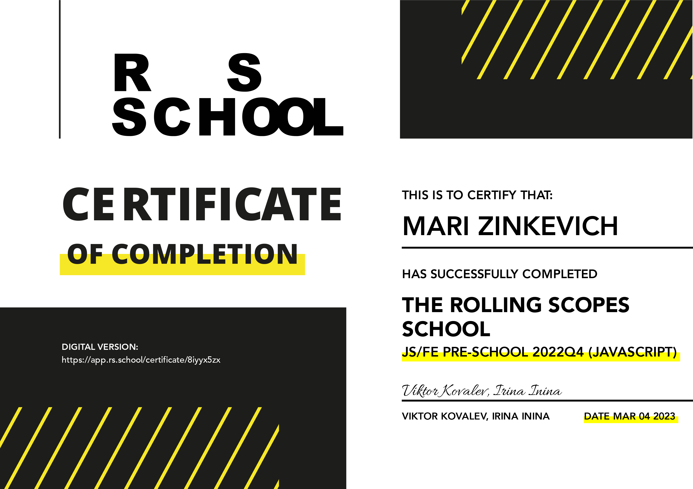

# Maria Zinkevich

===
## Contacts:
* Tel: 8(995)624-01-18
* Discord: MariZinkevich#7289
* GitHub: MariZinkevich
* E-mail: mari.v.zinkevich@gmail.com

===
## About myself:
I want to become the best front-end developer and save the world!

===
## Code example:
```
function howManyDalmatians (number)  {
   var dogs = ["Hardly any", "More than a handful!", "Woah that's a lot of dogs!", "101 DALMATIANS!!!"];

   var respond = number <= 10 ? dogs[0] : (number <= 50) ? dogs[1] : (number <= 100) ?  dogs[2] : dogs[3];

   return respond;
}
```

===
## Work experience:
* Landing page 1 - [Open-gbi](https://open-gbi.ru/)
* Landing page 2 - [Plants](https://rolling-scopes-school.github.io/marizinkevich-JSFEPRESCHOOL2022Q4/plants/#)

===
## Education:
* College: Petrovsky college, specialty technician-programmer
* [Basic JavaScript Tutorial](https://code.mu/ru/javascript/book/prime/)
* [Learn.JavaScript](https://learn.javascript.ru/)
* [Hexlet - Introduction to Git](https://ru.hexlet.io/courses/intro_to_git)
* [RSS - JS / FRONT-END. STAGE 0](https://rs.school/js-stage0/)


   [](image.png)  
   [Digital version of the certificate](https://rs.school/js-stage0/)  


===  

## English:
A2

